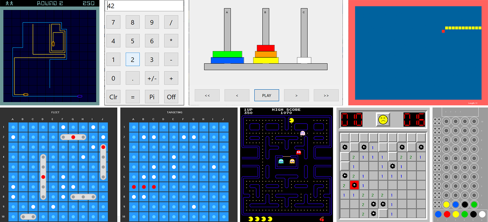

<p align="center">
<!----->
 <h1 align="center">Retro Games for VASmalltalk</h1>
  <p align="center">
    Retro games implemented with VASmalltalk!
    <!---
    <br>
    <a href="docs/"><strong>Explore the docs »</strong></a>
    <br>
    -->
    <br>
    <a href="https://github.com/vast-community-hub/retro-games-vast/issues/new?labels=Type%3A+Defect">Report a defect</a>
    |
    <a href="https://github.com/vast-community-hub/retro-games-vast/issues/new?labels=Type%3A+Feature">Request feature</a>
  </p>
</p>


Small collection of retro games (Pacman, Snake, BattleShip, etc.) implemented with VASmalltalk. Excellent examples for showing what you can do and for learning GUI development. Watch out [some screenshots](assets/screenshots/) to get an idea!



## License
- The code is licensed under [MIT](LICENSE).
- The documentation is licensed under [CC BY-SA 4.0](http://creativecommons.org/licenses/by-sa/4.0/).


## Installation

1. Install [VA Smalltalk 9.2.1 or newer](https://www.instantiations.com/products/vasmalltalk/download.html).
2. Install Tonel support in your development image following [this guide](https://github.com/vasmalltalk/tonel-vast#installation).
3. Clone this repository.
4. The easiest and recommended approach is to install it via a script:

```smalltalk
| loader path |
path := (CfsPath named: '<insert path to root retro-games-vast local repo here>').
loader := TonelLoader readFromPath: path.
loader
	beUnattended. "do not prompt and use all defaults"
	useGitVersion.
loader loadAllMapsWithRequiredMaps.
```

However, for a more fine-tuned or advanced installation, you can load the Configuration Map `Retro Games` from the context menu of the Configuration Maps Browser: `"Import"` -> `"Load Configuration Maps from Tonel repository..."` -> select path to root `retro-games-vast` local repo. This will open a dialog that allows you to customize many aspects of the Tonel load. Refer to [its documentation](https://github.com/instantiations/tonel-vast#using-gui-menus) for more details.

## Playing

Below is a script to start each game. They all have the same API:

```smalltalk
BattleshipWindow new open.
LightCyclesWindow new open.
MastermindWindow new open.
MinesweeperWindow new open.
PacmanWindow new open.
SnakeWindow new open.
STCalculator new open.
TowerOfHanoiWindow new open.
```

## Contributing

Check the [Contribution Guidelines](CONTRIBUTING.md)


## Acknowledgments

- [Lee Clayberg](https://github.com/LeeClayberg) for all the initial development of this project.
